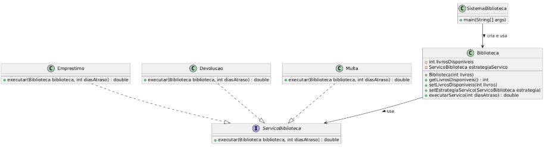

# Strategy Pattern

O **Strategy Pattern** é um padrão de projeto comportamental que define uma família de algoritmos, encapsula cada um deles e os torna intercambiáveis. Isso permite alterar o comportamento de um objeto em tempo de execução sem modificar sua estrutura.

## Estrutura do padrão

- **Interface Strategy**: define o método que todas as estratégias devem implementar.  
- **Concrete Strategies**: implementam diferentes algoritmos.  
- **Context**: utiliza a Strategy e pode alterar sua implementação dinamicamente.

## UML



## Código

```java
    // Strategy Interface
    public interface ServicoBiblioteca {
        double executar(Biblioteca biblioteca, int diasAtraso);
    }
    
    // ConcreteStrategy A: Empréstimo
    public class Emprestimo implements ServicoBiblioteca {
        @Override
        public double executar(Biblioteca biblioteca, int diasAtraso) {
            if (biblioteca.getLivrosDisponiveis() > 0) {
                biblioteca.setLivrosDisponiveis(biblioteca.getLivrosDisponiveis() - 1);
                System.out.println("Livro emprestado. Livros restantes: " + biblioteca.getLivrosDisponiveis());
                return 0.0;
            } else {
                throw new IllegalStateException("Não há livros disponíveis para empréstimo.");
            }
        }
    }
    
    // ConcreteStrategy B: Devolução
    public class Devolucao implements ServicoBiblioteca {
        @Override
        public double executar(Biblioteca biblioteca, int diasAtraso) {
            biblioteca.setLivrosDisponiveis(biblioteca.getLivrosDisponiveis() + 1);
            System.out.println("Livro devolvido. Livros disponíveis: " + biblioteca.getLivrosDisponiveis());
            return 0.0;
        }
    }
    
    // ConcreteStrategy C: Multa
    public class Multa implements ServicoBiblioteca {
        @Override
        public double executar(Biblioteca biblioteca, int diasAtraso) {
            double valorMulta = diasAtraso * 2.0;
            System.out.println("Valor da multa: R$ " + valorMulta);
            return valorMulta;
        }
    }
    
    // Context
    public class Biblioteca {
        private int livrosDisponiveis;
        private ServicoBiblioteca estrategiaServico;

    public Biblioteca(int livrosDisponiveis) {
        this.livrosDisponiveis = livrosDisponiveis;
    }

    public int getLivrosDisponiveis() {
        return livrosDisponiveis;
    }

    public void setLivrosDisponiveis(int livrosDisponiveis) {
        this.livrosDisponiveis = livrosDisponiveis;
    }

    // Permite ao cliente definir a estratégia em tempo de execução
    public void setEstrategiaServico(ServicoBiblioteca estrategiaServico) {
        this.estrategiaServico = estrategiaServico;
    }

    public double executarServico(int diasAtraso) {
        if (estrategiaServico == null) {
            throw new IllegalStateException("A estratégia de serviço não foi definida.");
        }
        return estrategiaServico.executar(this, diasAtraso);
    }
    }
    
    // Testando o Strategy Pattern
    public class SistemaBiblioteca {
        public static void main(String[] args) {
            Biblioteca biblioteca = new Biblioteca(3);

        // Cliente escolhe realizar empréstimo
        biblioteca.setEstrategiaServico(new Emprestimo());
        biblioteca.executarServico(0);

        // Cliente escolhe realizar devolução
        biblioteca.setEstrategiaServico(new Devolucao());
        biblioteca.executarServico(0);

        // Cliente escolhe calcular multa
        biblioteca.setEstrategiaServico(new Multa());
        biblioteca.executarServico(4); // 4 dias de atraso
    }
    }
